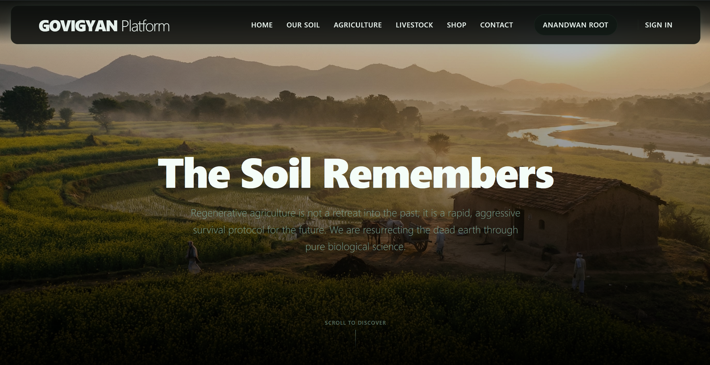

<div align="center">
  
</div>

<br>

# 🌿 Govigyan & Anandwan Monorepo

Welcome to the central repository powering both the **Govigyan** 🌾 (Ecological Sustainability & Regenerative Agriculture) and **Anandwan** 🛖 (Human Empowerment & Crafts) digital platforms.

Built specifically for the CEP Project, this robust, enterprise-grade architecture delivers a fluid, multi-themed Scrollytelling e-commerce and information engine ⚙️.

---

## 🚀 The Architecture

This project strictly adheres to a deeply optimized Full-Stack MERN stack 🍃 (MongoDB, Express, React, Node.js) configured across two specialized domains utilizing a shared `ThemeContext` router.

### **Tech Stack** 🛠️
- **Frontend Engine**: ⚛️ React (Vite) + 📘 TypeScript
- **Styling Pipeline**: 💅 Tailwind CSS (v4 compatible) + 🪞 Custom Glassmorphism System
- **Animation Layer**: 🎞️ Framer Motion (Spring Physics & AnimatePresence)
- **Backend APIs**: 🟩 Node.js + 🚂 Express.js
- **Database**: 🗄️ MongoDB (Atlas) + 🍃 Mongoose ORM
- **Asset Pipeline**: ☁️ Cloudinary CDN (Integrated Uploads + Smart Transformations)
- **Logistics Integration**: 💳 Razorpay JS SDK (Sandbox Execution Mode)

---

## 🎨 Theme Synchronization Engine

This monorepo utilizes a highly specialized `ThemeContext` 🌓 module bounding CSS variables locally to a global HTML selector. 
- **Govigyan** 🌱: Dynamic reconstruction of DOM coloring and typography to match dark, earthy greens and organic textures.
- **Anandwan** ☀️: Instant shift to vibrant, warm tones supporting human-upliftment aesthetics and forest-sanctuary vibes.

---

## 📦 Core Feature Modules

### 1. Immersive E-Commerce Pipeline 🛒
- **Global Shopping Cart** 🛍️: Protected React Context Cart stored in `localStorage` and periodic MongoDB synchronization.
- **Two-Step Secure Checkout** 🔐: Logistics management (Pre-filled via Auth profile) + Item review and Mock Authorization.
- **Mock Gateway** 💸: Implements the official Razorpay JS API in Sandbox Mode. Do NOT input real world credentials.

### 2. High-Performance Scrollytelling 📖
- **Dynamic Scroll Locks** 📜: Sections intelligently snap using 100vh CSS constraints.
- **Zero-Layout-Shift Media** 🖼️: 100% of images run through Cloudinary. Admin uploads are automatically optimized with `q_auto,f_auto` on delivery.

### 3. Fortified Authentication & Admin Hub 🛡️
- **JWT Infrastructure** 🔑: Secure token-based auth with state preservation.
- **Level 5 Administration Hub** 👑: 
   - **Product Deployment** 📤: Full UI for pushing new product containers (Title, Description, Ingredients, Stock, Pricing).
   - **Cloudinary Integration** 🌩️: Direct-to-Cloud binary uploads via Multer and Base64 tunneling.
   - **Admin Delegation** 🤝: Secure "Make Admin" system requiring current admin's password verification.
   - **GitHub-Style Safety** ⚠️: Destructive actions (Product Deletion) require explicit "Delete <ProductName>" text verification.

---

## 🛠 Project Initialization

The repository is configured as a concurrently-run monorepo for maximum developer efficiency ⚡.

```bash
# 1. Install Dependencies (Directly from Root)
npm run install:all

# 2. Setup Environment
# Ensure backend/.env contains:
# MONGO_URI, CLOUDINARY_CLOUD_NAME, CLOUDINARY_API_KEY, CLOUDINARY_API_SECRET

# 3. Boot the Entire Platform
npm run dev
```

---

## 📜 CEP Mock Data Rules
*This application is explicitly built to comply with the Mock-Only framework directives 🛑.*
- Features absolute zero real-money integration 🚫💵.
- The transaction processor exclusively utilizes simulated Razorpay signatures 💳. 
- All product databases are curated demonstration material 📦.

<br>
<p align="center">
  <i>Developed for ecological impact and educational demonstration 🌍.</i>
</p>
